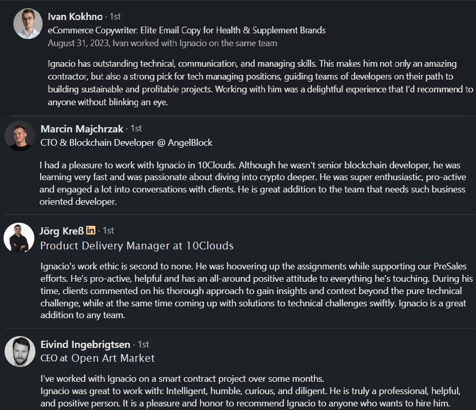
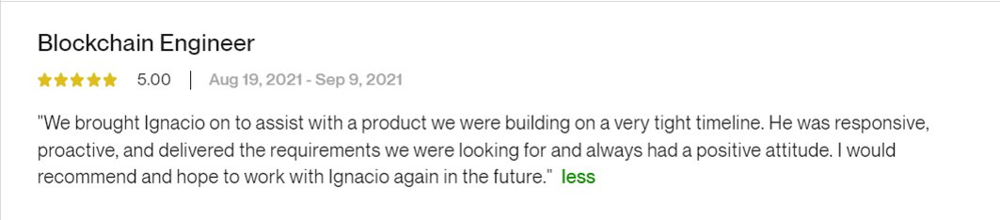
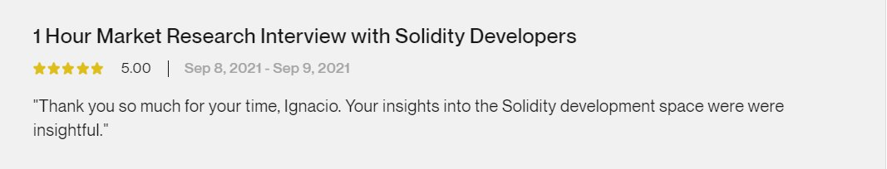
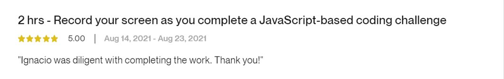

# 👨‍💻 Ignacio Ceaglio 💻🚀

**`Senior Solidity Developer + Technical Project Architect + People's Person = Blockchain C.T.O. On-Demand`**

👨🏻‍💻My Professional Passion is in Planning, Architecting, Developing and Testing projects like [Open Art Market](https://openartmarket.com) and [AngelBlock](https://www.angelblock.io) that help to democratize Valuable Investment opportunities for the common people and connect Real Word Assets (R.W.A.) to the Blockchain.                                                                                   

My clients and co-workers (Recommendations below) have praised me for being, in their own words; “very curious, pro-active, positive, humble, helpful, diligent, intelligent, passionate and ambitious”.👨🏻‍💻                                                                                                                                                                                                  

🔭 [Artizen.Fund](https://www.artizen.fund) Early Adopter.                                                                                                             
⛓ [Open Art Market](https://openartmarket.com) (Production) Foundational Solidity Smart Contracts Developer.                                                                             
📊 [AngelBlock](https://www.angelblock.io) Early Investor.                                                                                                                                                    
🌦 [ANZAIRU](https://anzairu.com) and ⚽️[VERTULO](https://vertulo.com) ex-C.T.O.

   

      
      
     
     
     
   

   
---

## 🛠️ Languages and Tools

 
                                     
 

# 🗳️ What people say:

<!--
## 📊 GitHub Stats:
 
-->

## 🏆 GitHub Trophies:
                                                                                                

 
<h3>👨‍💻 About me:</h3>

👨🏼‍💻Blockchain C.T.O./Tech Guy for Hire💻:
🤔Are you a Blockchain Start-Up that doesn't have a C.T.O./Have one without Real Life Coding Skills?🤔 💢No problem! I can support you if you Temporarily need a C.T.O. for:                              

✳️ Hiring a Software Development/Technical Talent for creating your M.V.P.                                                                                                                                    
✳️ Understanding the processes and struggles of Blockchain Software Development.                                                                                                                              
✔️"It's not about the finished Product; it's about the Process".                                                                                                                                              
✔️"It's not about Coding, it's about Communication".                                                                                                                                                          
✅I Understand for you the Complex Technical things that you need to know, and I Communicate for you to the Developers the needs that you don't know how to explain.                                          
  
📔I feel very comfortable teaching things to others and leading small teams.                                                                                                                                     
📈Passionate about Investments, GeoPolitics and Economics.                                                                                                                                                       
📚I am very ambitious and curious and I am continually learning new things.                                                                                                                                                                                                                                                                            
                                                                                              
⌨️I get a lot of messages from recruiters. To respect both of our time, instead of messaging me, please fill out this form:
https://forms.gle/tdW6E2nHVWxmAh9Z9

### 😂 Random Dev Meme

---

<!-- Proudly created with GPRM ( https://gprm.itsvg.in ) -->
