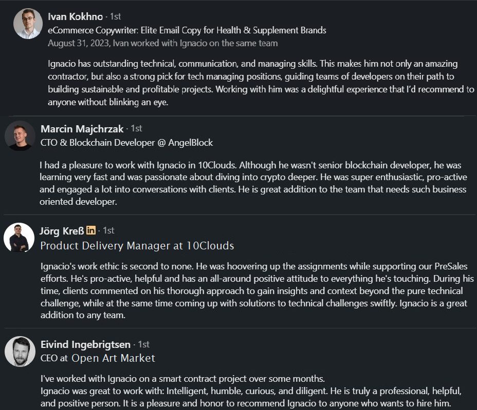

# 👨‍💻 Ignacio Ceaglio 💻🚀

**`Freelance Senior Data Engineer SQL | Senior Data Scientist and Machine Learning Engineer MLOps PYTHON | Consultant💻 |`**                           

💻Senior/Lead Software Engineer with +6 Years of Experience within all sorts of organizations and +30 Data Industry Relevant Certifications.📜
📈End-to-End Data Professional👨🏼‍🔧covering: Data Science and Engineering, Machine Learning Engineering, Data Governance (GDPR and EU AI Act) and Compliance Auditing, and implementation of organization-wide Data Literacy📓.
                                                                                   

My clients and co-workers (Recommendations below) have praised me for being, in their own words; “very curious, pro-active, positive, humble, helpful, diligent, intelligent, passionate and ambitious”.👨🏻‍💻    

📜 Creator of the [ERC-7776: Transparent Financial Statements Standard](https://eips.ethereum.org/EIPS/eip-7776).                                                                                             
🔭 [Artizen.Fund](https://www.artizen.fund) Web2.0-to-Web3.0 Transition Architect.                                                                                                             
⛓ [Open Art Market](https://openartmarket.com) (Production) Foundational Solidity Smart Contracts Developer.                                                                             
📊 [AngelBlock](https://www.angelblock.io) Early Investor.                                                                                                                                                    
🌦 [ANZAIRU](https://anzairu.com) and ⚽️[VERTULO](https://vertulo.com) ex-C.T.O.

   

      
      
     
     
     
   

   
---

## 🛠️ Languages and Tools

 
                                     
 

# 🗳️ What people say:

<!--
## 📊 GitHub Stats:
 
-->

## 🏆 GitHub Trophies:
                                                                                                

